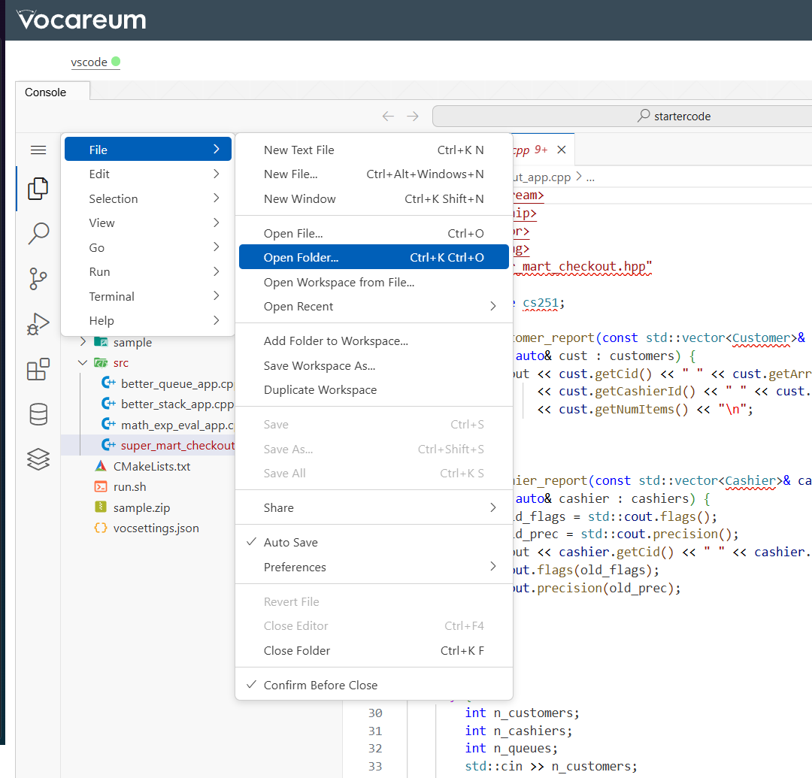
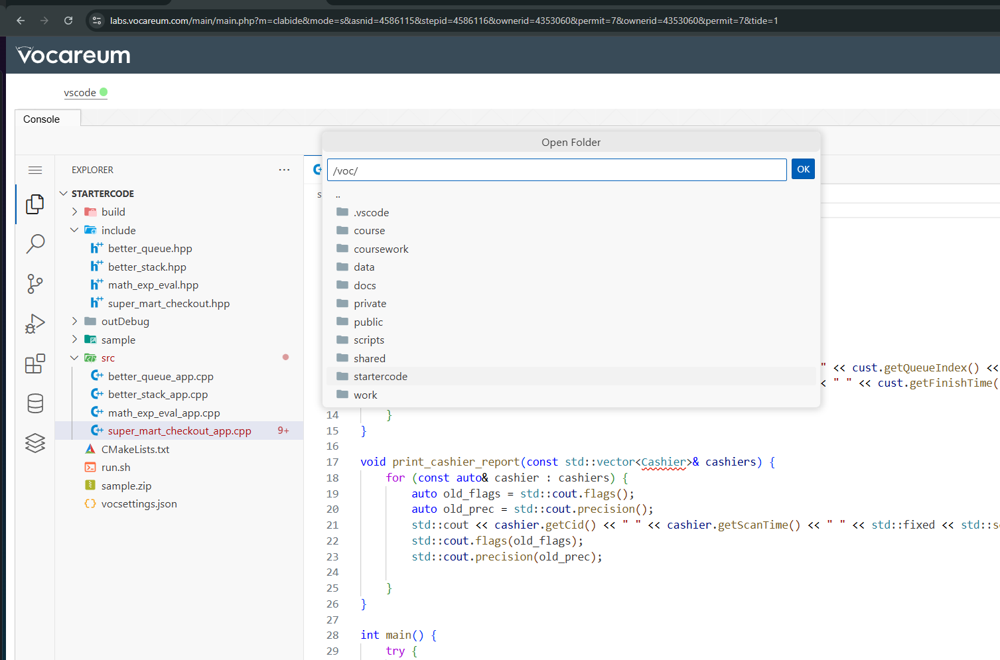
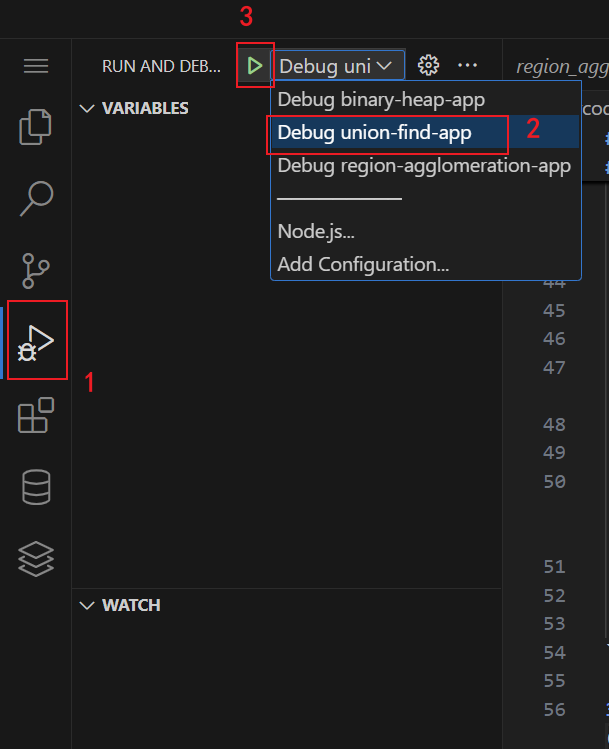
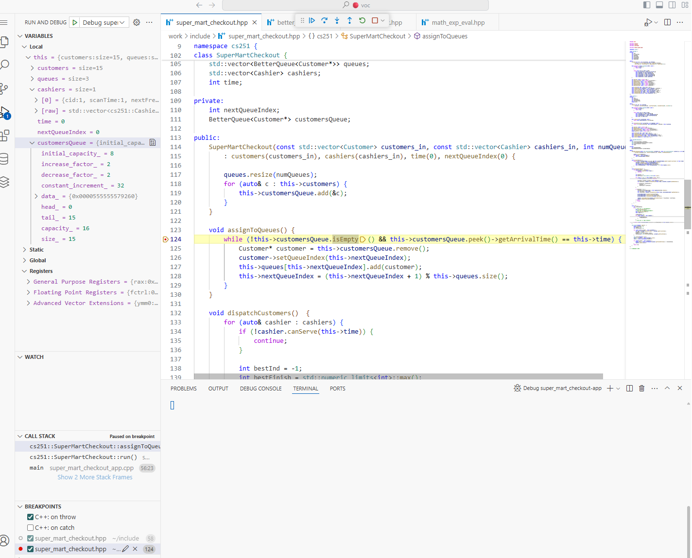

# Useful Tips
## Change the workspace root folder




## copy from `startercode` to `work` the src and sample_tests files (**warning: override existing src and sample_tests files.**)

```bash
cp -r /voc/startercode/sample_tests /voc/work/
```

```bash
cp -r /voc/startercode/src /voc/work/
```

## VS Code Debugging Tools
1. Terminal>Run Build Task...(ctrl/cmd+shift+B), and select the build task to run. The compiled apps will be at `/voc/work/outDebug/`
2. Open `/voc/.vscode/launch.json` and change the `"args"` config for different heap testcases (`["input path"]`).
2. Open `/voc/.vscode/launch.json` and change the `"stdio"` config for different csp testcases (`["input path", null, null]`).
The default configuration uses the #01 testcases:
```json
{
    "version": "0.2.0",
    "configurations": [
        {
            "type": "lldb",
            "request": "launch",
            "name": "Debug heap-app",
            "program": "${workspaceFolder}/work/outDebug/heap-app",
            "args": ["/voc/startercode/sample/input/heap_test_1.txt"],
            "cwd": "${workspaceFolder}/work/src"
        },
        {
            "type": "lldb",
            "request": "launch",
            "name": "Debug csp-app",
            "program": "${workspaceFolder}/work/outDebug/csp-app",
            "args": [],
            "cwd": "${workspaceFolder}/work/src",
            "stdio": ["/voc/startercode/sample/input/csp_input_tiny_1.txt", null, null]
        }
    ]
}
```

3. Click the 'Run and Debug' panel on the left (ctrl/cmd+shift+D). Select the app to debug. If asked to install the CodeLLDB extension, install it and re-open the VS Code interface.





You can add breakpoints to the .hpp files and inspect variables.
